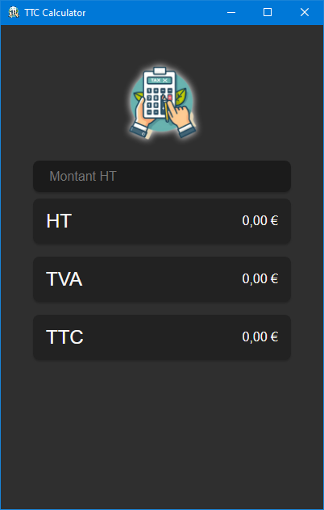

# TTC Calculator (Tauri + Vanilla)

Desktop TVA and TTC calculator, written in rust and tauri (vanilla).



## Recommended IDE Setup

- [VS Code](https://code.visualstudio.com/) + [Tauri](https://marketplace.visualstudio.com/items?itemName=tauri-apps.tauri-vscode) + [rust-analyzer](https://marketplace.visualstudio.com/items?itemName=rust-lang.rust-analyzer)

# Run

```sh
$ cargo tauri dev
```

# Build

```sh
$ cargo tauri build
```